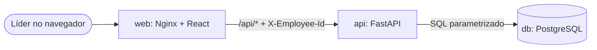

# Avaliação de Liderados

Plataforma web para que um líder avalie todos os funcionários da sua hierarquia (diretos e indiretos), com notas de 1 a 4 ponderadas por critério, limite de uma avaliação por semana para cada par líder-funcionário e visibilidade restrita à linha hierárquica.

| Camada | Tecnologia |
|---|---|
| Front-end | React 18, TypeScript, Vite, React Router, TanStack Query |
| Back-end | Python 3.12, FastAPI, psycopg 3 (SQL parametrizado) |
| Banco | PostgreSQL 16 |
| Infraestrutura | Docker Compose (3 serviços na mesma rede) + Nginx |

## Sumário

- [Execução rápida (Docker)](#execução-rápida-docker)
- [Como usar](#como-usar)
- [Execução sem Docker](#execução-sem-docker)
- [Testes](#testes)
- [Arquitetura e fluxo](#arquitetura-e-fluxo)
- [Regras de negócio](#regras-de-negócio)
- [Estrutura do repositório](#estrutura-do-repositório)
- [Documentação complementar](#documentação-complementar)

## Execução rápida (Docker)

Pré-requisitos: Docker e Docker Compose v2.

```bash
git clone <url-do-repositorio>
cd avaliacao-lideranca
docker compose up --build
```

| Serviço | Endereço |
|---|---|
| Aplicação | http://localhost:8080 |
| Documentação da API (Swagger) | http://localhost:8080/api/docs |
| API direta | http://localhost:8000/api |
| PostgreSQL | `localhost:5432` (usuário, senha e banco: `evaluation`) |

Na primeira subida, o PostgreSQL executa automaticamente, em ordem, os scripts de `database/`:

1. `01_employees_dump.sql`: dump fornecido no case (sem alterações);
2. `02_evaluation_schema.sql`: perguntas, avaliações, respostas e regras de integridade.

**Chaves e variáveis.** O projeto não usa chaves de serviços externos. Os valores padrão já funcionam; para alterá-los (portas em conflito, credenciais), copie `.env.example` para `.env` e edite.

**Recriar o banco do zero** (apaga as avaliações):

```bash
docker compose down -v && docker compose up --build
```

## Como usar

1. Abra http://localhost:8080 e escolha um líder no seletor **Avaliando como** (por exemplo, *Bob Sinclair (CTO)*). A escolha fica salva no `localStorage` do navegador.
2. A tela da equipe lista os liderados diretos e indiretos com a avaliação mais recente visível para esse líder.
3. Clique em **Avaliar**, atribua uma nota de 1 a 4 a cada critério e confirme o envio. A nota final prevista aparece antes do envio.
4. Clique em **Ver histórico** para consultar todas as avaliações visíveis e as respostas de cada critério.
5. Para agir como outro líder, basta trocar o nome no seletor.

Cenário sugerido para conferir as regras: avalie Henry como **David**; troque para **Bob** e confirme que a avaliação de David aparece e que Bob também pode avaliar Henry; volte para **David** e confirme que a avaliação feita por Bob não aparece para ele.

## Execução sem Docker

Requer Python 3.10+, Node.js 20+ e um PostgreSQL local.

```bash
# 1. Banco
createdb evaluation
psql -d evaluation -f database/01_employees_dump.sql
psql -d evaluation -f database/02_evaluation_schema.sql

# 2. Backend (porta 8000)
cd backend
python -m venv .venv
source .venv/bin/activate        # Windows: .venv\Scripts\activate
pip install -r requirements.txt
export DATABASE_URL=postgresql://<usuario>:<senha>@localhost:5432/evaluation
uvicorn app.main:app --reload

# 3. Front-end (porta 5173, com proxy de /api para a porta 8000)
cd ../frontend
npm install
npm run dev
```

## Testes

Os testes cobrem o cálculo da nota e as regras de negócio do serviço usando repositórios em memória, sem depender do banco.

```bash
# Com Docker em execução
docker compose exec api pytest -v

# Ou localmente, dentro de backend/ com o ambiente virtual ativo
pytest -v
```

## Arquitetura e fluxo



- O navegador acessa somente o Nginx, que serve o build do React e repassa `/api` ao backend (mesma origem, sem CORS em produção).
- O backend é organizado em **rotas** (HTTP) → **serviço** (regras de negócio) → **repositórios** (SQL). Erros de domínio são convertidos em status HTTP em um único ponto (`app/main.py`).
- A hierarquia é resolvida por uma **CTE recursiva** com detecção de ciclos, em uma única consulta.

Diagramas completos (componentes, modelo de dados e sequência do envio) em [`docs/02-arquitetura.md`](docs/02-arquitetura.md).

### Identificação do líder

Não há login, conforme o case. O front-end guarda o id do líder escolhido em `localStorage` e o envia em todas as requisições no cabeçalho `X-Employee-Id`. O backend valida o id e aplica todas as regras de acesso a partir dele. Trocar de líder é trocar o valor no seletor do topo da página.

## Regras de negócio

| Regra | Garantia |
|---|---|
| Notas inteiras de 1 a 4, todas as perguntas obrigatórias | Pydantic + serviço + `CHECK` no banco |
| Nota final = Σ(nota × peso) ÷ Σ(peso), de 1,00 a 4,00 | Calculada no backend com `Decimal` |
| Avaliação imutável após o envio | Sem endpoints de edição + trigger que bloqueia `UPDATE`/`DELETE` |
| Uma avaliação por semana (segunda a domingo) por par líder-funcionário | Constraint `UNIQUE (evaluator_id, evaluated_id, week_start)` |
| Líder avalia diretos e indiretos, mesmo que o subordinado já tenha avaliado no período | Limite aplicado ao par, não ao funcionário |
| Ninguém vê a própria avaliação, nem as de pares ou superiores | Acesso apenas a subordinados (CTE recursiva) |
| O líder vê avaliações feitas por ele ou por líderes abaixo dele ("maior hierarquia") | Filtro `visible_evaluator` nas consultas |

Premissas e interpretações estão detalhadas em [`docs/01-historias-de-usuario.md`](docs/01-historias-de-usuario.md).

## Estrutura do repositório

```
.
├── docker-compose.yml
├── .env.example
├── database/
│   ├── 01_employees_dump.sql      # dump do case
│   └── 02_evaluation_schema.sql   # perguntas, avaliações, regras de integridade
├── backend/
│   ├── app/
│   │   ├── main.py                # app FastAPI, CORS, tradução de erros
│   │   ├── config.py              # variáveis de ambiente
│   │   ├── database.py            # pool de conexões
│   │   ├── dependencies.py        # conexão, líder atual, serviço
│   │   ├── errors.py              # erros de domínio
│   │   ├── schemas.py             # contratos de entrada/saída
│   │   ├── routers/               # employees, questions, evaluations
│   │   ├── services/              # evaluation_service, scoring
│   │   └── repositories/          # SQL (hierarchy_sql com a CTE recursiva)
│   └── tests/
├── frontend/
│   ├── nginx.conf                 # serve o build e repassa /api ao backend
│   └── src/
│       ├── main.tsx               # providers: React Query, sessão, notificações, rotas
│       ├── App.tsx                # barra superior e rotas
│       ├── styles.css             # tokens de design (cores, sombras, bordas) e estilos
│       ├── api/                   # cliente HTTP tipado e tipos da API
│       ├── session/               # líder atual (localStorage)
│       ├── pages/                 # Equipe, Nova avaliação, Histórico
│       ├── components/            # cartões, diálogo, notificações, medidor de nota, gráfico...
│       └── utils/                 # formatação de datas e notas, prévia da nota
└── docs/
    ├── 01-historias-de-usuario.md
    ├── 02-arquitetura.md
    ├── 03-api.md
    ├── 04-front-end.md
    └── imagens/                   # capturas de tela
```

## Documentação complementar

- [Histórias de usuário, critérios de aceite e premissas](docs/01-historias-de-usuario.md)
- [Arquitetura, modelo de dados e diagramas](docs/02-arquitetura.md)
- [Endpoints da API com exemplos](docs/03-api.md)
