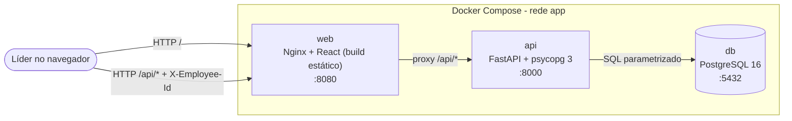
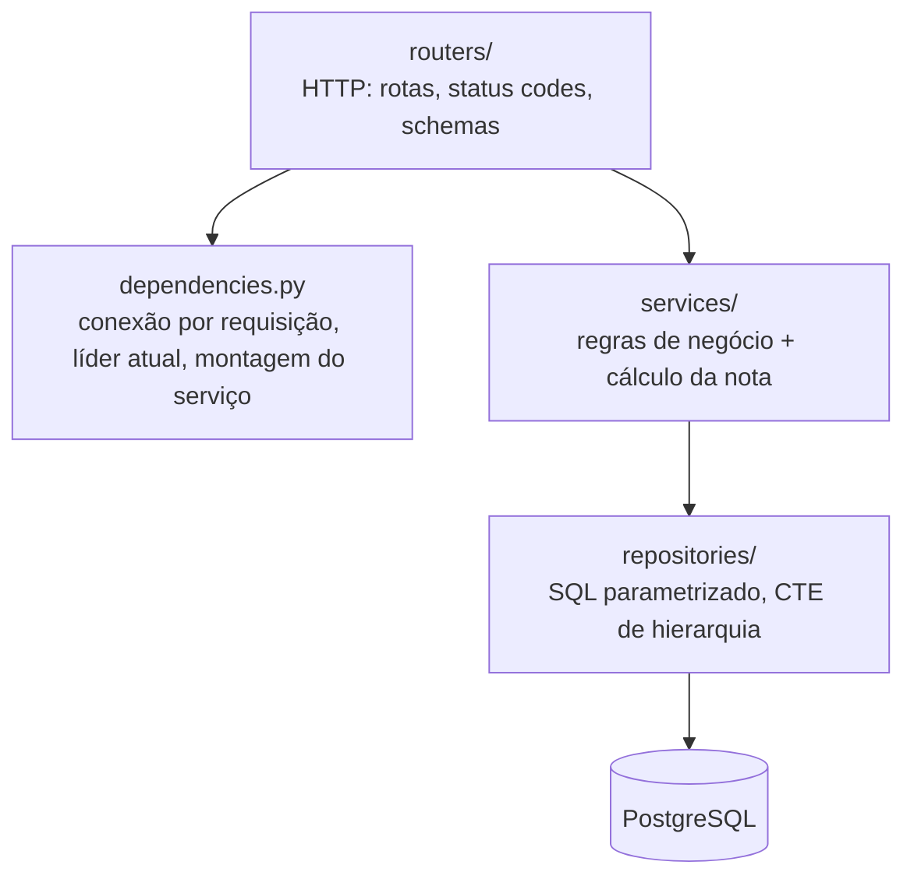
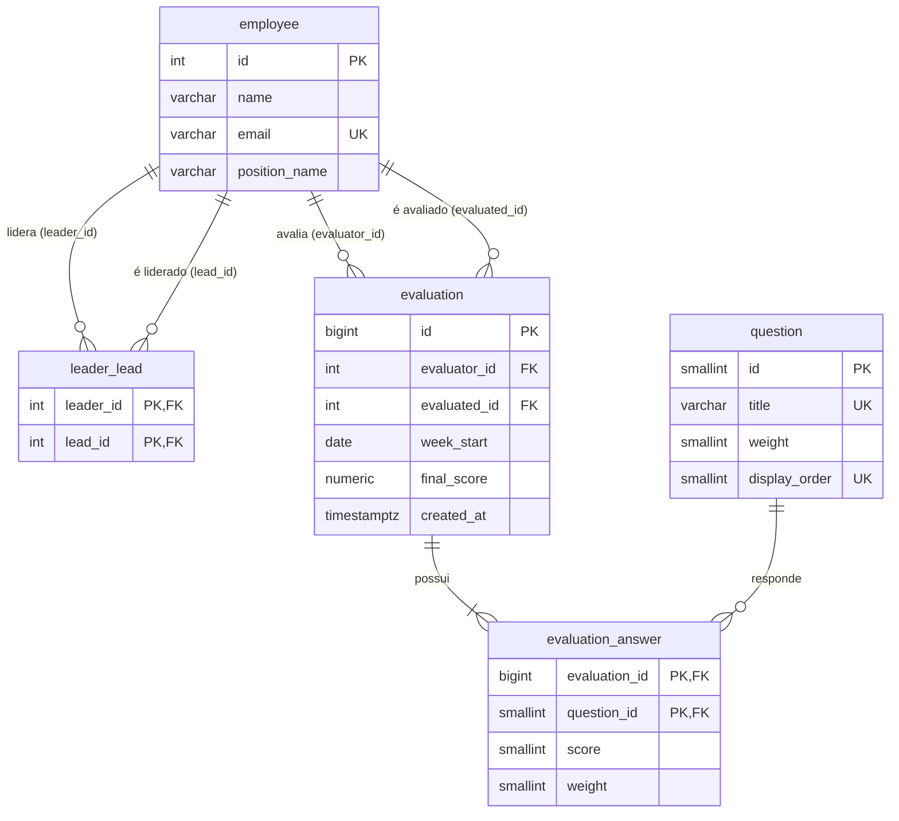
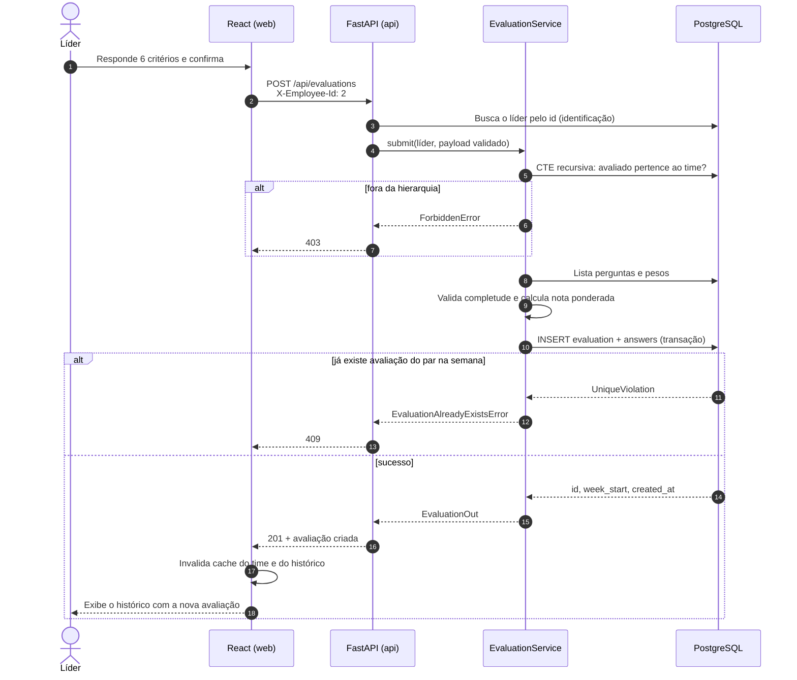

# Arquitetura

## Visão geral

Três serviços em contêineres na mesma rede Docker. O navegador fala apenas com o Nginx, que entrega o front-end e repassa `/api` ao backend. Assim front e API compartilham a mesma origem e não há necessidade de CORS em produção.

## Camadas do backend

| Camada | Responsabilidade | Não deve conhecer |
|---|---|---|
| `routers` | Receber a requisição, validar o formato (Pydantic) e devolver a resposta | SQL e regras de negócio |
| `services` | Autorização por hierarquia, completude das respostas, nota ponderada | HTTP e SQL |
| `repositories` | Consultas e gravações no banco | HTTP e regras de negócio |
| `errors.py` + `main.py` | Traduzir erros de domínio para status HTTP em um único ponto | — |

O serviço depende de interfaces (`Protocol`), o que permite testá-lo com repositórios em memória (`backend/tests`).

## Modelo de dados

Restrições relevantes em `evaluation`: `UNIQUE (evaluator_id, evaluated_id, week_start)`, `CHECK (evaluator_id <> evaluated_id)`, `CHECK (final_score BETWEEN 1 AND 4)` e trigger que bloqueia `UPDATE`/`DELETE` (também em `evaluation_answer`).

## Fluxo: envio de uma avaliação

## Identificação do líder (sem login)

1. O front-end lista os funcionários em `GET /api/employees` e mostra o seletor "Avaliando como".
2. O id escolhido é salvo em `localStorage` (chave `avaliacao.leaderId`) e enviado em todas as requisições no cabeçalho `X-Employee-Id`.
3. A dependência `get_current_employee` valida o id; ausente ou inexistente resulta em 401.
4. Trocar de líder é trocar o valor no seletor. As chaves de cache do React Query incluem o id do líder, então nenhum dado de um líder aparece para outro.

Em produção, este cabeçalho seria substituído por um token (por exemplo, JWT emitido por um provedor de identidade), sem mudança nas camadas de serviço e repositório: apenas `get_current_employee` passaria a extrair o id do token.

## Decisões técnicas

| Decisão | Motivo |
|---|---|
| PostgreSQL | O dump fornecido já é PostgreSQL (`SERIAL`, `setval`); oferece CTE recursiva com detecção de ciclo (`CYCLE`) e constraints robustas |
| FastAPI | Validação declarativa com Pydantic, OpenAPI gerado automaticamente (documentação de endpoints) e injeção de dependências simples |
| SQL explícito com psycopg 3, sem ORM | A regra central é uma consulta hierárquica recursiva; escrevê-la em SQL deixa a lógica visível, eficiente (uma ida ao banco) e parametrizada |
| Regras críticas também no banco | Limite semanal e imutabilidade continuam válidos mesmo com requisições concorrentes ou acesso direto ao banco |
| React Query | Cache, estados de carregamento/erro e invalidação após o envio sem código manual de sincronização |
| Nginx como proxy reverso | Mesma origem para front e API, sem CORS em produção e com o build estático servido de forma eficiente |
