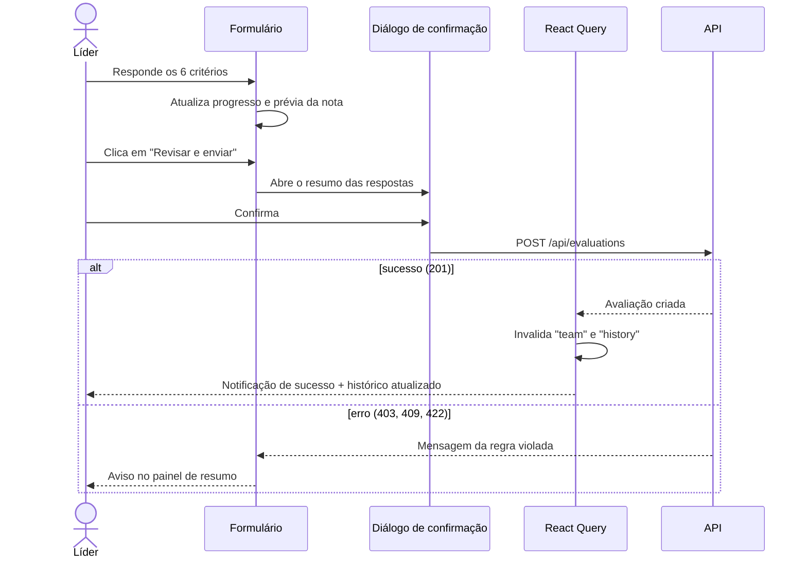

# Front-end

Aplicação de página única (SPA) em React 18 + TypeScript, empacotada com Vite e servida pelo Nginx. Este documento descreve a organização do código, o fluxo de dados, as telas, os componentes, o sistema visual e as decisões de usabilidade e acessibilidade.

> As capturas de tela deste documento foram geradas com dados de exemplo.

## Sumário

- [Stack e princípios](#stack-e-princípios)
- [Estrutura de pastas](#estrutura-de-pastas)
- [Rotas](#rotas)
- [Fluxo de dados e estado](#fluxo-de-dados-e-estado)
- [Telas](#telas)
- [Componentes](#componentes)
- [Sistema visual](#sistema-visual)
- [Usabilidade e acessibilidade](#usabilidade-e-acessibilidade)
- [Responsividade](#responsividade)
- [Decisões técnicas](#decisões-técnicas)

## Stack e princípios

| Biblioteca | Papel |
|---|---|
| React 18 + TypeScript | Interface e tipagem estática dos contratos da API |
| Vite | Servidor de desenvolvimento e build de produção |
| React Router | Navegação entre as telas |
| TanStack Query (React Query) | Cache, carregamento, erros e sincronização dos dados da API |

Nenhuma biblioteca de componentes visuais foi adicionada. Diálogo, seções expansíveis, ícones e gráfico usam recursos nativos do navegador (`<dialog>`, `<details>`, SVG), o que mantém o pacote pequeno e o comportamento acessível por padrão.

Princípios adotados:

1. **O backend é a fonte da verdade.** O front-end exibe e antecipa informações (por exemplo, a prévia da nota), mas toda regra de negócio é validada na API.
2. **Cada componente tem uma responsabilidade.** Páginas orquestram dados; componentes apenas apresentam.
3. **Visual com significado.** Cores, sombras e bordas comunicam hierarquia e estado, não são decoração.

## Estrutura de pastas

```
frontend/src/
├── main.tsx                  # providers: React Query, sessão, notificações, rotas
├── App.tsx                   # barra superior e definição das rotas
├── styles.css                # tokens de design e estilos de todos os componentes
├── api/
│   ├── client.ts             # fetch tipado, cabeçalho X-Employee-Id, tratamento de erros
│   └── types.ts              # espelho dos schemas da API
├── session/
│   └── SessionContext.tsx    # líder atual (localStorage) e sincronização entre abas
├── pages/
│   ├── TeamPage.tsx          # equipe: indicadores, busca, filtros, tabela por nível
│   ├── EvaluatePage.tsx      # formulário de avaliação e confirmação
│   └── HistoryPage.tsx       # linha do tempo, resumo e evolução
├── components/               # componentes reutilizáveis (ver tabela abaixo)
└── utils/
    └── format.ts             # datas, notas, semana corrente, iniciais, prévia da nota
```

## Rotas

| Rota | Tela | Requisito atendido |
|---|---|---|
| `/` | Equipe | Avaliar todos da hierarquia; identificador do avaliado; avaliação mais recente |
| `/team/:employeeId/evaluate` | Nova avaliação | Respostas de 1 a 4 com pesos; envio imutável; uma por semana |
| `/team/:employeeId/history` | Histórico | Histórico de avaliações e respostas cadastradas, respeitando a hierarquia |

Qualquer outra rota redireciona para `/`. Enquanto nenhum líder estiver escolhido, as rotas não são exibidas e a tela orienta o uso do seletor "Avaliando como".

## Fluxo de dados e estado

### Identificação do líder

`SessionContext` guarda o id do líder em `localStorage` (chave `avaliacao.leaderId`). Esse id é enviado pelo `api/client.ts` no cabeçalho `X-Employee-Id` de cada requisição que depende dele.

- **Persistência:** a escolha sobrevive a recarregamentos da página.
- **Sincronização entre abas:** o evento `storage` do navegador atualiza as outras abas abertas quando o líder é trocado.
- **Autocorreção:** se a API responder 401 (id salvo inexistente), a identificação é limpa automaticamente.
- **Troca de líder:** volta para a tela da equipe, porque a página atual pode ser de alguém fora da nova hierarquia.

### Cache de dados (React Query)

Cada consulta é identificada por uma chave. Todas as chaves que dependem do líder incluem o id dele, o que impede que dados de um líder apareçam para outro após a troca.

| Chave | Endpoint | Observação |
|---|---|---|
| `['employees']` | `GET /employees` | Não expira durante a sessão (lista estável) |
| `['questions']` | `GET /questions` | Não expira durante a sessão |
| `['me', leaderId]` | `GET /me` | Valida o líder salvo |
| `['team', leaderId]` | `GET /team` | Compartilhada pelas três telas |
| `['history', leaderId, employeeId]` | `GET /team/{id}/evaluations` | Uma entrada por liderado |

Após um envio bem-sucedido, as chaves `team` e `history` do avaliado são invalidadas. Com isso, o status "Avaliado por você" e a linha do tempo são atualizados sem recarregar a página.

Política de nova tentativa: respostas 4xx (regras de negócio, como 403 e 409) **não** são repetidas, porque são definitivas; falhas de rede e erros 5xx são repetidas até duas vezes.

### Fluxo de envio de uma avaliação



## Telas

### Equipe


| Área | Conteúdo | Por que existe |
|---|---|---|
| Faixa superior | Identidade do líder | Deixa claro em nome de quem as avaliações serão feitas |
| Indicadores | Pessoas na hierarquia, avaliadas na semana (com progresso), pendentes e média das últimas notas | Responde de imediato "o que falta fazer esta semana?" |
| Busca | Nome, cargo ou e-mail, ignorando acentos e maiúsculas | Localização rápida em equipes grandes |
| Abas | Todos, Pendentes, Diretos e Indiretos, com contadores | Filtra pelo recorte mais comum de trabalho |
| Tabela | Agrupada por nível (diretos, 2º nível...), com líder direto, última avaliação, situação e ações | Torna a hierarquia visível e mostra o identificador do avaliado e a avaliação mais recente |

O botão **Avaliar** só aparece para quem ainda não foi avaliado pelo líder na semana corrente.

### Nova avaliação


- Cada critério mostra seu peso em número e em percentual da nota, com uma barra proporcional.
- A escala de 1 a 4 é um controle segmentado (grupo de botões de rádio), operável por mouse, toque ou setas do teclado.
- O marcador numerado do critério vira um ✓ quando respondido, e uma barra no topo do cartão acompanha o progresso.
- O painel lateral, fixo durante a rolagem, mostra a nota final prevista e a contribuição de cada critério (nota × peso).
- O envio só é habilitado com todos os critérios respondidos e passa por um diálogo de confirmação:


Se o líder já avaliou a pessoa na semana, o formulário não é exibido e a tela informa quando uma nova avaliação será possível.

### Histórico


- **Linha do tempo:** avaliações visíveis da mais recente para a mais antiga, ligadas por uma linha vertical. A mais recente vem aberta e destacada.
- **Detalhe de cada avaliação:** autor, data, semana e tabela de critérios com peso, nota e pontos. A última linha mostra a conta da nota final (pontos ÷ peso total).
- **Coluna lateral:** nota mais recente, variação em relação à anterior, média do período, data da primeira avaliação e gráfico de evolução.
- **Aviso de visibilidade:** lembra que só aparecem avaliações feitas pelo líder ou por líderes abaixo dele.

## Componentes

| Componente | Responsabilidade |
|---|---|
| `PageHeader`, `MetaChip` | Faixa superior da página: navegação (breadcrumb), identidade, etiquetas e ações |
| `Card`, `CardHeader` | Contêiner padrão de seção: cabeçalho, divisórias e rodapé |
| `LeaderSwitcher` | Seletor "Avaliando como" |
| `Avatar` | Iniciais com cor estável por funcionário |
| `ScoreBadge` | Nota numérica com cor por faixa |
| `ScoreMeter` | Medidor de 4 segmentos que representa a escala 1–4 |
| `StatusPill` | Situação na semana (pendente / avaliado) |
| `ScoreTrend` | Gráfico de linha em SVG da evolução da nota |
| `ConfirmDialog` | Diálogo de confirmação acessível (`<dialog>` nativo) |
| `Toast` (`ToastProvider`, `useToast`) | Notificações temporárias |
| `Feedback` (`Notice`, `EmptyState`, `SkeletonRows`) | Mensagens, estados vazios e carregamento |
| `Icon` | Conjunto de ícones em SVG, sem dependência externa |

## Sistema visual

Todos os valores estão definidos como variáveis CSS no início de `styles.css`, o que permite ajustar o visual em um único lugar.

### Elevação (sombras)

Cada nível de sombra tem um papel fixo, para que a profundidade comunique hierarquia:

| Token | Uso |
|---|---|
| `--shadow-xs` | Elementos em repouso: botões, tabelas, itens da linha do tempo |
| `--shadow-sm` | Cartões principais de conteúdo |
| `--shadow-md` | Resposta ao cursor (hover) |
| `--shadow-lg` | Camadas sobrepostas: diálogo e notificações |

### Bordas e cantos

| Token | Valor | Uso |
|---|---|---|
| `--radius-sm` | 6px | Etiquetas e elementos pequenos |
| `--radius-md` | 8px | Botões, campos e controles |
| `--radius-lg` | 12px | Cartões e diálogo |

Bordas de 1px (`--line`) separam seções dentro dos cartões; bordas mais fortes (`--line-strong`) delimitam controles interativos.

### Estrutura das páginas

Todas as telas seguem o mesmo padrão:

1. **Faixa escura** com navegação, identidade e ações principais;
2. **Corpo sobreposto**: o conteúdo sobe sobre a faixa (`margin-top` negativo), criando camadas;
3. **Cartões** com cabeçalho (título, descrição, ações), seções divididas e rodapé opcional.

### Linguagem da nota

A escala 1–4 tem uma representação visual única em todo o produto: o medidor de quatro segmentos, que preenche parcialmente o último segmento em notas fracionadas (por exemplo, 3,25). As cores servem apenas como apoio visual, com o número sempre exibido ao lado:

| Faixa | Cor |
|---|---|
| 3,50 a 4,00 | Verde |
| 2,50 a 3,49 | Âmbar |
| 1,00 a 2,49 | Vermelho |

Essas faixas são uma convenção de interface e não fazem parte das regras de negócio do case.

### Tipografia

IBM Plex Sans para a interface e IBM Plex Serif para nomes em destaque e notas grandes, carregadas do Google Fonts, com fontes do sistema como alternativa. Números usam algarismos tabulares, que mantêm as colunas alinhadas.

## Usabilidade e acessibilidade

| Recurso | Implementação |
|---|---|
| Notificação após envio | `ToastProvider`; região `aria-live="polite"` anuncia sem mover o foco; some em 5 s |
| Atalho de busca | Tecla `/` foca a busca (ignorada quando o usuário já digita em outro campo); `Esc` limpa o termo |
| Confirmação de ação irreversível | `<dialog>` nativo: foco preso no diálogo, fundo bloqueado, `Esc` cancela |
| Navegação por teclado | Escala de notas com botões de rádio nativos (setas do teclado); anel de foco visível em todos os elementos |
| Tabela da equipe | Construída com CSS Grid, mas declara papéis ARIA de tabela (`table`, `row`, `columnheader`, `cell`) |
| Barra superior | Ganha sombra quando a página rola, indicando conteúdo por baixo |
| Carregamento | Esqueletos no lugar de textos, evitando deslocamento do layout |
| Estados vazios | Explicam a situação e oferecem a próxima ação (por exemplo, "Limpar filtros") |
| Datas | Formato relativo ("há 3 dias"), com a data completa ao passar o mouse |
| Movimento reduzido | Animações desativadas quando o sistema operacional pede (`prefers-reduced-motion`) |
| Cores | Textos sobre fundo branco com contraste mínimo de 4,5:1 (nível AA da WCAG); a informação nunca depende só da cor |

## Responsividade

| Largura | Adaptação |
|---|---|
| Acima de 1100px | Layout completo: tabela da equipe com colunas e 4 indicadores em linha |
| Até 1100px | Indicadores em grade 2×2; linhas da tabela reorganizadas com rótulos por campo |
| Até 900px | Painéis laterais (resumo, evolução) passam para baixo do conteúdo principal |
| Até 640px | Uma coluna; cada pessoa da equipe vira um bloco empilhado; escala de notas ocupa toda a largura |


## Decisões técnicas

| Decisão | Motivo |
|---|---|
| Sem biblioteca de componentes visuais | Menos dependências, pacote menor e controle total do visual; os recursos nativos já resolvem diálogo, expansão e acessibilidade |
| CSS com variáveis em um único arquivo | Tokens centralizados e sem etapa extra de build; suficiente para o tamanho do projeto |
| React Query no lugar de estado global manual | Cache, carregamento, erro e invalidação sem código repetitivo |
| Prévia da nota no cliente | Feedback imediato durante o preenchimento; a nota oficial continua sendo calculada pela API |
| Gráfico em SVG próprio | Uma única linha com poucos pontos não justifica uma biblioteca de gráficos |
| Ícones em SVG próprios | Evita uma dependência para apenas 17 ícones simples |

Pontos naturais de evolução: exibir a hierarquia como árvore (exigiria a API devolver o id do líder direto), tema escuro (já facilitado pelas variáveis CSS) e testes de componentes com Testing Library.
